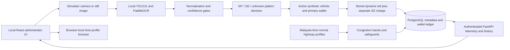

# Architecture Notes

PlatePlus is a modular local capstone prototype with separate ML/OCR, business
logic, persistence and administrator UI boundaries. It is flat-rate-only and all
traffic, owners, wallets and payments remain simulated.

## Current recognition path

Optional backend-only Gemini can resolve unread/ambiguous uploads after local ALPR.
It never processes webcam frames. Results pass PlatePlus validation before the
same synthetic vehicle/account/pricing/payment workflow. When invoked, image/crop
bytes leave the local machine for Google processing; PlatePlus does not persist
them. Keys remain backend-only. See [fallback architecture](GEMINI_FALLBACK.md).

1. Accept a still image.
2. Detect the license plate region using a YOLO model trained for `car plate` only.
3. Crop the plate region.
4. Run OCR on the crop.
5. Normalize the recognized plate text.
6. Apply detection/OCR confidence gates and conservative origin classification.
7. Reject overlapping/unsupported patterns; otherwise match an active fictional
   vehicle with the same declared registration origin and its active primary account.
8. Read that location's latest non-future stored toll; add the configured foreign
   charge for accepted Singaporean or supported other-foreign origin, then debit the combined total once if funded.
9. Store detection, itemized transaction, wallet ledger and notification metadata.

## Service Boundaries

- Detection service: YOLO inference and confidence reporting.
- Crop service: plate-region extraction from still images.
- OCR service: text recognition and OCR confidence reporting.
- Plate normalization/origin service: auditable raw/normalized text, constrained
  correction and separate supported Malaysian/Singaporean pattern rules.
- Vehicle service: synthetic registered vehicle lookup.
- Pricing service: configurable congestion-to-price rules.
- Transaction service: simulated balance checks and toll transaction recording.
- Traffic service: simulated traffic records and congestion classification.
- Dashboard service: admin-only metrics and history views.

## Normal network

Normal generated traffic uses LDP, AKLEH, NPE, and Grand Saga. Simulator Toll Plaza
is separate and derives congestion only from accepted local ALPR crossings. Retired
highway history remains queryable but is excluded from current selectors, network
monitoring, and generation. See [network configuration and migration](MULTI_LOCATION.md).

## Data Scope

Pricing is flat-rate-only. The pricing service uses the selected location's configured
`base_toll` and congestion multiplier, with minimum toll, maximum multiplier, hysteresis,
and change-interval safeguards. It requires no journey, entry/exit pair, or distance.
The payment service reads the latest non-future stored price at that same location,
then adds the separate simulated foreign charge for an eligible Singaporean or supported other-foreign vehicle.
All base tolls are prototype configuration unless explicitly sourced. See
[flat-rate scope](FLAT_RATE_SCOPE.md) and [V3 migration verification](V3_DATABASE_MIGRATIONS.md).

All account, traffic, payment, and vehicle-owner data is synthetic. Do not connect to real payment providers, real toll infrastructure, real enforcement systems, or real owner databases.

## Runtime and data flow

Unknown or ambiguous origin exits before successful payment. The one-class detector
does not classify countries; deterministic pattern rules do not verify nationality,
ownership or registration. Raw input bytes and crops are not retained by default.

Normal generation targets only LDP, AKLEH, NPE and Grand Saga. Accepted Simulator
crossings derive live congestion from `(now - 60 seconds, now]`, capacity 10,
including accepted insufficient-balance outcomes; unknown origin and cooldown
duplicates create no active crossing. Historical records remain after expiry.
Simulator speed is unavailable. Pricing and payment replay do not create extra
crossings or deductions.

The UI has exactly Overview, Dynamic Pricing Management and Prediction. Model
Performance is a modal, and local ALPR remains in Overview. Pricing history is
read-only with a chart/table alternative; foreign-charge editing is separately
labelled. Prediction reads current telemetry but does not write live data or model
future origin/foreign charges.

Localhost is the primary presentation architecture: React/Vite, FastAPI,
PostgreSQL and local model assets. Vercel frontend/Render API compatibility remains,
but remote APIs exclude raw-image and webcam inference. No cloud inference or
external owner/payment service is required by the local demo.

See [schema](DATABASE_SCHEMA.md), [API contracts](API.md),
[setup](SETUP.md) and [evaluation](TESTING_EVALUATION.md).
